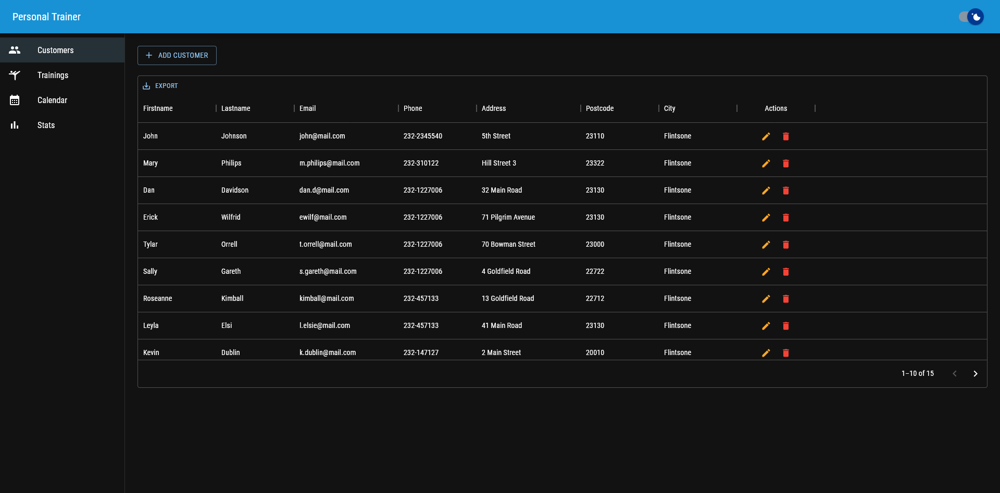
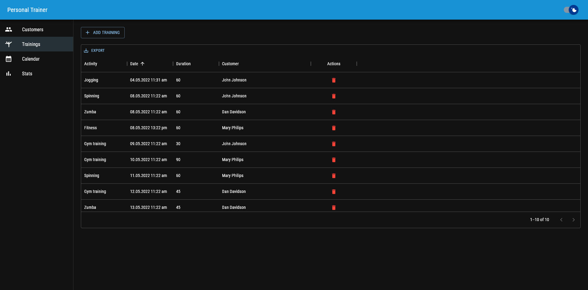

<h1 align="center">
   PersonalTrainer
</h1>

    <strong>PersonalTrainer is a React application made to help you organize your training efficiently and effortlessly 🏋🏼‍♂️</strong>

    <a href="https://github.com/d-roduit/personal-trainer">
        
        
        
        
    </a>

 

## Table of Contents

1. [Run the web application](#run-web-application)
2. [Technologies](#technologies)
3. [Guides and resources](#guides-and-resources)
4. [Authors](#authors)
5. [License](#license)

## Run the web application

You will need to follow the steps below in order to run the web application :

1. Install the Node.js runtime on your computer. You can find the link to download it under the [Guides and resources](#guides-and-resources) section.
2. Download this repository and unzip it.
3. With a shell (CMD, PowerShell, Bash, etc), navigate to the unzipped folder and execute the `npm install` command.
4. Run the project by executing `npm start`.

Once these four steps have been executed, you will be able to open the URL `http://localhost:3000` in your browser and use **PersonalTrainer** !

## Technologies

The project is made in JavaScript and uses the React library to create the web application.

The front-end uses :
- Material UI (MUI)

The back-end uses :
- Node.js
- A custom API given by the teacher to create / retrieve the data

## Guides and resources
* [React](https://fr.reactjs.org/) - JavaScript library for building user interfaces
* [Node.js](https://nodejs.org/en/) - Server runtime
* [Material UI](https://mui.com/) - React component library which implements Google's Material Design system

## Authors

<table>
   <tbody>
      <tr>
         <td align="center" valign="top" width="100%">
            <a href="https://github.com/d-roduit">
             
            Daniel Roduit
            </a>
         </td>
      </tr>
   </tbody>
</table>

## License

This project is licensed under the MIT License
